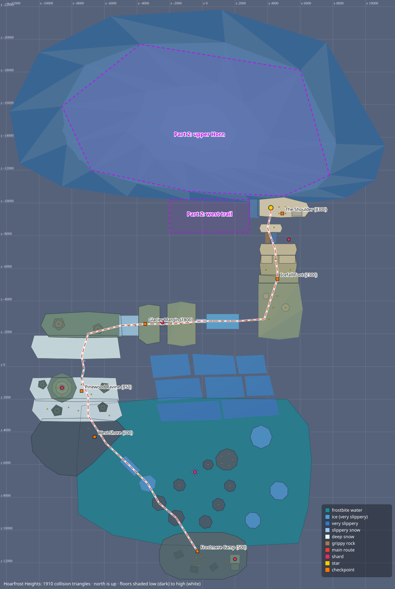

# Hoarfrost Heights: design notes

> **Status: built and tested (v0.7.0), from Frostmere Camp to the summit and back.**
> Changing the level? Read [Building rules](#building-rules-read-before-adding-geometry) and
> [Changing the level](#changing-the-level) first, and keep `npm test` green.

*The map is generated: `node tools/level_map.mjs hoarfrost docs/hoarfrost-map.svg`. Regenerate it after changing the level. The white line is the main route: up to the summit, then the Avalanche Run home down the east side.*

## At a glance

A high valley floats on a sea of cloud under the **Hoarfrost Horn**. You start at Frostmere Camp on the valley's southern lip. The route crosses frozen Mirror Lake, climbs the snowbound Pinewood, rides a glacier chute, and scales an icefall to the Shoulder and the **Icefall Star**, halfway up the Horn. From there it climbs the Frozen Falls, crosses Gale Ridge in a wind that always blows south, hangs from a cornice up the west ridge to the summit's **Aurora Star**, and slides home down the **Avalanche Run**. Eight Frost Shards reveal the **Polar Star** on the Mirror Isle.

| | Cinder Caldera | Hoarfrost Heights |
|---|---|---|
| Footprint | 12,800 × 12,800 | 23,000 × 34,800 (with the Horn's massing) |
| Height climbed | 3,200 | 10,100 (summit snowfield; the Horn's Tip stands at 11,200) |
| Collision triangles | 1,260 | 2,698 (budget `BUDGET` 3,000; the core holds 4,096) |
| Stars | 2 | 3: Icefall Star, Aurora Star (the goal: the clock stops here), Polar Star (bonus) |
| Shards | 8 | 8 Frost Shards |
| Coins | 52 | 100 |
| Checkpoints | 5 | 9 |

Files: `web/hoarfrost.js` (geometry, pickups, checkpoints, copy, theme), `web/hoarfrost-scene.js` (render-only dressing), `web/builder.js` (the geometry kit), `tests/hoarfrost.test.mjs` (proofs), `tests/routes.mjs` (the route-proof kit), `tools/level_map.mjs` and `tools/level_shots.mjs` (map and screenshots).

## The route, as built: the valley

Coordinates are `[x, y, z]` in SM64 units; +X is east, −Z is north. `route` in `web/hoarfrost.js` lists the valley's waypoints in order, and `createHoarfrost` adds the climb above the Shoulder and the slide home (`world.route`).

| # | Section | What you do | Moves it needs | Where |
|---|---|---|---|---|
| 1 | **Frostmere Camp** (checkpoint `camp`) | Start. Tents, a campfire, a signpost, the watchtower. | — | plateau at y 500, around `[0, 500, 11500]` |
| 2 | **Mirror Lake** | Hop north-west across snow floes. The third floe is ice tilted 13° toward the runway: it slides you at once, and you jump from the slide. The runway is flat ice (you cannot stop); a 1,100-unit channel of frostbite water needs a **long jump** to the west shore. | running jumps, slide jump, long jump | floes y 100–180, runway y 90 at `[-4430, 90, 6080]` |
| 3 | **Pinewood Drifts** (checkpoint `shore`) | Two terraces of deep snow (runs top out at 24), each 350–400 up: a jump and **ledge grab** out of slow snow. | jump + grab | y 100 → 450 → 850 |
| 4 | **Pinewood Ravine** (checkpoint `ravine`) | A fallen pine spans a gorge into the clouds. It is 130 wide, iced (slick), and snapped in two: jump the break. Then a 400 step and a slippery 18° ramp to the glacier. | narrow beam, gap jump, grab | log y 850 → 1000, terrace 1400, margin 1800 |
| 5 | **The Glacier** (checkpoint `margin`) | Jump the first crevasse (450). A plate climbs east to a snow bridge. The **ice chute** drops 400 over 2,000 units: you slide at ~93 units a tick, and must **jump before the lip** to clear the 1,200-unit Great Crevasse. The far side stands higher than the lip, so sliding off without a jump hits its wall. Then a snowfield rises north. | slide jump (window ~100–600 units before the lip) | chute `x 250..2250`, y 2150 → 1750 |
| 6 | **The Icefall** (checkpoint `icefall`) | A 400 serac step (grab), a **950-unit wall-kick chimney** (walls 420 apart), then the **rock rib**: grippy rock at 45° beside an identical ice chute that cannot be climbed. A ~450-unit gap (the bergschrund) to the Shoulder. | grab, wall kicks, running jump | foot y 2300 → 2700 → 3650 → 4350 |
| 7 | **The Shoulder** (checkpoint `shoulder`) | The Halfway Hut and the **Icefall Star** on a cairn. The Horn's south face rises behind it as a sheer cliff; a sign points west along the ledges to the Frozen Falls. | a 260 step | y 4300, star at `[4200, 4700, -9700]` |

## The route, as built: the upper Horn

| # | Section | What you do | Moves it needs | Where |
|---|---|---|---|---|
| 8 | **The Frozen Falls** (from `shoulder` to checkpoint `falls`) | A ledge trail runs west along the foot of the face at y 4300, broken twice (~350 and ~450): jump each break. The falls are a block of ice against the face (its south side is the frozen curtain). Wall-kick 800 up the 400-wide shaft between the curtain and a free-standing serac, hop to the near ledge, then jump up and **hang from the icicle overhang** (a `HANGABLE` underside at y 5600) and traverse ~1,260 west (12 seconds) to the far ledge. A grippy rock rib climbs to the flat top of the falls. | running jumps, wall kicks, hang traverse | ledges y 4300, serac top 5100, near ledge `x 250..500` and far ledge `x −1400..−900` at 5300, falls top y 6400 |
| 9 | **Gale Ridge** (from `falls` to checkpoint `ridge`) | Six paths cut into the Horn's south-west face climb west. Five are **wind** floors: the gale always blows **south**, so standing still blows you off the open edge in about a second. Keep moving and jump each gap (~290–510) from its very edge. The fourth path is a sheltered rock gully (the checkpoint); the last two climb north, straight into the wind, to the west ridge. | running jumps in the wind | y 6400 → 7000, from `[-1400, 6400, -11450]` to `[-5870, 7000, -14070]` |
| 10 | **The Cornice and the Summit** (from `ridge` to checkpoint `summit`, then the summit) | Four grippy rock steps climb the west ridge's crest (tops 7267 → 7857). Beyond them the crest is bare and very slippery, so **hang from the cornice**: a 1,000-long snow cornice astride the crest, slick on top, whose underside can be hung from all the way up (it rises 31°, ~11 seconds). Let go over the summit ledge (8500). **Wall-kick 900 up the chimney** between two rock towers 460 apart, then follow a rock ramp to the summit snowfield (10,100). Hop onto the cairn for the **Aurora Star**. | hang traverse, wall kicks | steps from `[-5615, 7267, -14179]`, ledge y 8500, towers to 9400, star at `[-300, 10500, -14350]` |
| 11 | **The Avalanche Run** (the way home) | From the summit's east edge, an ice luge swings down past the Horn's east peak, runs south on a raised track past the icefall and the glacier, and curls round over the lake into Frostmere Camp, whose snow stops the slide. Walls line both sides (at ~100 units a tick a slide bounces off them). The track breaks twice at a lip: **jump from the slide** at each one. About 13 seconds from top to bottom. | slide jumps | from `[300, 10100, -14350]` to `[2650, 500, 11000]`, lips at `[7700, 6000, -7300]` and `[7700, 2600, 3300]` |

The lake also has a side loop (Lone Floe → Mirror Isle → floes → back to camp), proven hop by hop. The Mirror Isle holds the Polar Star's ice spire.

### Frost Shards and the Polar Star

| Id | Where | Challenge | Proven by |
|---|---|---|---|
| `shard-tower` | Watchtower lookout, camp | From the woodshed roof (400 up, a grab), **backflip** 480 onto the lookout (a double jump also works; a single jump cannot). | backflip plan; negative single-jump check |
| `shard-floe` | The Lone Floe, Mirror Lake | A ~650-unit hop onto a 200-radius ice floe. **Let go of the stick as you land** or you slide off. | land-and-stop plan |
| `shard-pine` | Crown of the Great Pine, Pinewood | Four boughs, each ~340 above the last: jump and grab, bough to bough. Boughs are walkable snowy cones 160 thick (so their lips can be grabbed). | per-bough plans |
| `shard-crevasse` | A ledge inside the first crevasse | Hang from the edge, drop 650 onto the ledge, then **wall-kick** out (walls 450 apart). | hang-drop, kick-out plans |
| `shard-needle` | Serac needle beside the chimney top | A **double jump** and grab from the chimney top (+580; a single jump cannot). | double-jump plan; negative check |
| `shard-falls` | An ice pillar under the icicle overhang, the Frozen Falls | **Let go of the overhang** above the pillar. Its cap flares out (r 150 over a r 60 stem), so its rim cannot be grabbed. From the pillar, jump back up to the overhang and hang on to the far ledge. | release plan; negative checks: no plain jump from either ledge lands on it |
| `shard-vane` | The Weathervane, Gale Ridge | A rock promontory juts south from the second path. The Weathervane's tower stands ~600 beyond it, across a gulf where a hidden wind floor far below blows south (no steering in the air over it). Going out, a **jump from the very edge** makes it; coming home into the wind, only a **long jump** does. | out plan; home long-jump plan; negative: a plain jump home falls short |
| `shard-tip` | The Horn's Tip, the summit | An ice needle (top 11,200) beside a rock tor (top 11,050), ~450 apart: **wall-kick** up between them to the tor's top, then jump across to the needle. | kick and jump plans; negative: no jump, double jump or backflip gets above 11,000 |
| `polar-star` (bonus) | The ice spire on the Mirror Isle | Appears when all eight shards are found. A **double jump** and grab from the isle reaches the spire's top (770); a single jump cannot. Three coins ring the star. | double-jump plan; negative single-jump check |

An expert shortcut exists at the Frozen Falls: a long jump from the very edge of the near ledge (a window of about a tick) can just grab the far ledge's rim, skipping the hang. The tests prove only that no plain or double jump makes it.

## How the surfaces behave (measured with the real core)

These numbers come from driving the unchanged core. Design gaps and slopes around them.

| Behaviour | Measured |
|---|---|
| Run speed | 32 (deep snow 23.6, ice 30.5) |
| Running jump | ~840 far, peak ~335 |
| Running long jump | ~1,520 far on the flat (deep snow ~1,440: air control recovers speed) |
| Double jump / triple jump peak | ~490 / ~630 |
| Backflip / side somersault peak | ~512 / ~512 |
| Reach with a ledge grab | single 450 (from deep snow ~330 is comfortable), double or triple 600, backflip 500 |
| Wall-kick shaft | walls ≤ 550 apart work indefinitely; 700 does not |
| Braking from a full run | default 105, slippery 330, **ice/very slippery 1,180** |
| Reversing on ice | ~1,080 of skid past the turn |
| Landing a jump and letting go | stops within ~80–100 on **any** surface (the landing action), so ice only bites when you run |
| Uphill running (200 ticks) | default: fine to ~40°, slides from 45°; slippery: to ~20°, slides from 25°; **ice/very slippery: stalls at ~12°, slides from ~20°**; **not slippery (rock): climbs even 65°**; deep snow: like default, slower |
| Very slippery slope ≥ 10° | you butt-slide down it, reaching ~90–100 a tick, with strong steering; A jumps out of the slide (jump speed ×0.8, vertical 42 + ¼ speed). On a flat very slippery floor the slide keeps its speed. |
| Fall damage | > 1,150 → 2 wedges; > 3,000 → 4 wedges (landing on a slope steep enough to slide avoids the smaller one) |
| Frostbite water (`SURFACE_BURNING`) | 3 wedges and a launch, exactly like lava |
| Hanging (`HANGABLE` ceiling) | ~4 units a tick (the Frozen Falls' 1,260 takes 12 seconds); the body hangs 160 below the ceiling. A sloped ceiling still holds up to ~31° (the cornice). |
| Wind (`SURFACE.WIND`, 0x2C) | **always pushes toward +Z (south)**: the host never sets a surface force. Standing: ~4.7 a tick; a jump drifts ~400 south; running north into it: about half speed; running east/west: unaffected. Acts only while the floor under you is a wind floor, including in the air: over a wind floor far below you cannot steer, and a long jump loses its boost. The core requests `SOUND_ENV_WIND2` (bank 4, ID 0x10) every tick on it; `audio.js` plays a gusting wind bed. |

## Building rules (read before adding geometry)

- **Every gap needs a floor far below.** Where there is no floor at all, the core treats the space as an invisible wall. The hidden catch floor at y −2,600 (`ABYSS`, style `hidden`) covers x −16,000..16,000, z −24,000..16,000; keep new geometry inside it. Falling below y −1,500 returns you to your beacon (`rules.js`).
- **Never leave a floor under a gap that you cannot escape.** Before the Horn was pulled back, its lower slope ran under the bergschrund: a fall there would have wedged you between a slippery slope and a wall. Run the trap scan idea from the tests: drop the explorer over each gap and make sure every fall either lands somewhere climbable or drops below −1,500.
- **Where two walkable surfaces meet, their edges must meet at the same height.** If a slab overhangs a lower ramp, its wall pokes up above the ramp and stops you (walls block from 30 units above your feet). This bit the glacier margin once.
- **Slab outlines must be convex** (tops are fanned); `builder.slab` throws if one is not.
- **Ledge grabs need a wall under the lip.** Your feet must be ~100–238 below the lip while you touch a wall, so anything you grab (boughs, ledges) must be ≥ ~120 thick. Grabbed floors must be flatter than 25°. A cap that flares outward (a sloped underside instead of a wall) cannot be grabbed: the Frozen Falls' pillar uses that.
- **Colour tells the player what a surface does:** white snow is safe, blue is ice (you slide), bright white is deep snow, grey rock grips, and the gale's paths are a shade greyer than snow. Keep that language.
- **Checkpoints must stand on flat floors** (the spawn test compares heights exactly).
- **Coins belong to the checkpoint whose stretch they sit on** (`section` = the checkpoint's name): the menu counts coins per checkpoint. Coins over a gap (tracing a jump) need `{arc:true}` and a test that a real jump collects them.
- **Budget:** the level is capped by `BUDGET` (3,000) in `web/hoarfrost.js`. The core holds 4,096 triangles; collision is a linear scan, so ~4,000 is fine at 30 Hz, but test searches get slower with every triangle.
- **Walls and slabs get a snow `lip`** (a band of the top colour on each wall) so terraces read as snow over rock or ice.
- **The camera sees up to 44,000** (`theme.far`), and fog runs 8,000–38,000. The sky dome, aurora and stars follow the camera.

Learned on the upper Horn:

- **A steep slope that runs down into a wall is a trap** (a V you slide into and cannot leave). Paths on the Horn are **cut into** its face (`cut` in `web/hoarfrost.js`): their inner edge runs on under the slope, so anything sliding down the Horn flows onto the path instead of wedging against a wall.
- **Put structures on crests and terraces, not against slopes.** The west ridge's steps, cornice, ledge and towers all sit astride the crest (`astride`), buried below it.
- **Faces a few degrees short of vertical are still floors, not walls.** An 86° face on the Horn let falls leak through where a wall would have stopped them; make cliffs exactly vertical instead.
- **Watch for closed hollows between mountains.** A lesser peak west of the Horn made a pocket where a fall could slide forever; it was removed.
- **Keep lab floors modest.** The core's point-in-triangle test uses 32-bit products, so a triangle much bigger than the catch floor (32,000 × 40,000) can overflow and vanish.
- **Run the trap scan after every change**: drop the explorer on a grid over the area and check that every fall settles somewhere, grabs a ledge, or drops into the clouds.

## Changing the level

1. **Plan in the lab first.** Measure each new jump or kick with `tests/routes.mjs` from a scratch script before fixing coordinates: `routeKit(world)`, `hopper`, `reachable`, and the plan builders (`jump`, `jumpNear`, `longJump`, `double`, `backflip`, `kicks`, `climb`). Chained hops need position-triggered jumps (`jumpNear`), not tick counts.
2. **Prove every leg and shard** in `tests/hoarfrost.test.mjs`, with a negative check wherever a specific move is meant to be required. Timing searches stop at the first success; give negative searches a `lost` test (`settled` in the file) so failed attempts end early. The file runs in about 50 seconds.
3. **Coins** belong to the checkpoint whose stretch they sit on; coins over a gap need `{arc:true}` and a test that the intended move collects them.
4. **Dressing** in `web/hoarfrost-scene.js` is render-only. Keep props at edges or out of reach, and never let dressing look walkable where it is not. Check the look with `tools/level_shots.mjs`.
5. **Re-check** for traps and for junctions where a wall pokes above a walkable edge, then regenerate the map.

## Tools

- `node tools/level_map.mjs hoarfrost [out.svg]`: top-down map of floors by height and surface type, walls, pickups, checkpoints and the route.
- `node tools/level_shots.mjs hoarfrost '[["name",[camX,camY,camZ],[lookX,lookY,lookZ]]]'`: screenshots through the real renderer into `build/level-shots/` (needs Playwright, like the browser check).
- `tests/routes.mjs`: the route-proof kit used by `tests/hoarfrost.test.mjs`.
